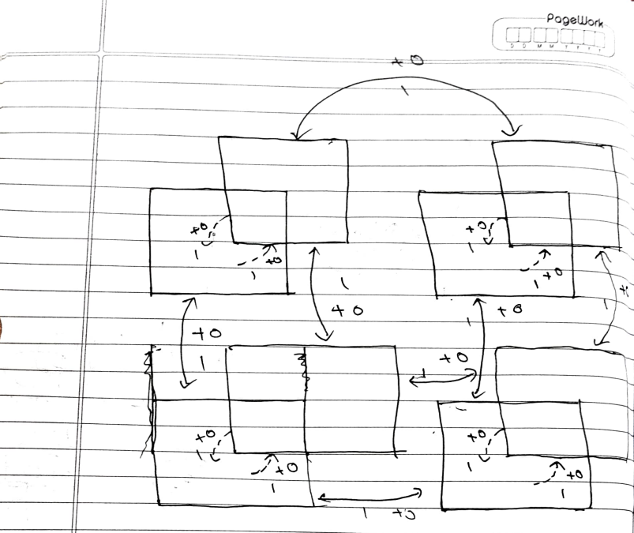

# MDP REPRESENTATION

## AIM:
To create an rudimentary AI agent for a simple drone navigation task

## PROBLEM STATEMENT:

### Problem Description
There is a 2X2X2 cube like enviroinment,where each bloack is a 3 dimensional cube space, our goal is to navigate from the begining to the goal. 

### State Space

{(u-1-lh),(u-2-lh),(u-1-rh),(u-2-rh),(l-1-lh),(l-2-lh),(l-1-rh),(l-2-rh)}

### Sample State

(u-1-lh)

### Action Space

up,down,left,right,forward,backward

### Sample Action

up

### Reward Function

+1 if it reaches goal state,
0  otherwise


### Graphical Representation



## PYTHON REPRESENTATION:
```py
P= {
    (u-1-lh):{
        down:[(1.0,(l-1-lh),0.0,False)],
        right:[(1.0,(u-1-rh),0.0,False)],
        forward:[(1.0,(u-2-lh),0.0,False)],
    }
    (u-2-lh):{
        down:[(1.0,(l-2-lh),0.0,False)],
        right:[(1.0,(u-2-rh),1.0,True)],
        backward:[(1.0,(u-1-lh),0.0,False)],
    }
    (u-1-rh):{
        down:[(1.0,(l-1-rh),0.0,False)],
        left:[(1.0,(u-1-lh),0.0,False)],
        forward:[(1.0,(u-2-rh),1.0,True)],
    }
    (u-2-rh):{
        down:[(1.0,(l-2-rh),0.0,False)],
        left:[(1.0,(u-2-lh),0.0,False)],
        backward:[(1.0,(u-1-rh),0.0,False)],
    }
    (l-1-lh):{
        up:[(1.0,(u-1-lh),0.0,False)],
        right:[(1.0,(l-1-rh),0.0,False)],
        forward:[(1.0,(l-2-lh),0.0,False)],
    }
    (l-2-lh):{
        up:[(1.0,(u-2-lh),0.0,False)],
        right:[(1.0,(l-2-rh),0.0,False)],
        backward:[(1.0,(l-1-lh),0.0,False)],
    }
    (l-1-rh):{
        up:[(1.0,(u-1-rh),0.0,False)],
        left:[(1.0,(l-1-lh),0.0,False)],
        forward:[(1.0,(l-2-rh),1.0,True)],
    }
    (l-2-rh):{
        up:[(1.0,(u-2-rh),1.0,True)],
        left:[(1.0,(l-2-lh),0.0,False)],
        backward:[(1.0,(l-1-rh),0.0,False)],
    }

}
```
## OUTPUT:


## RESULT:

Thus the given real world problem is successfully represented in a MDP form.


